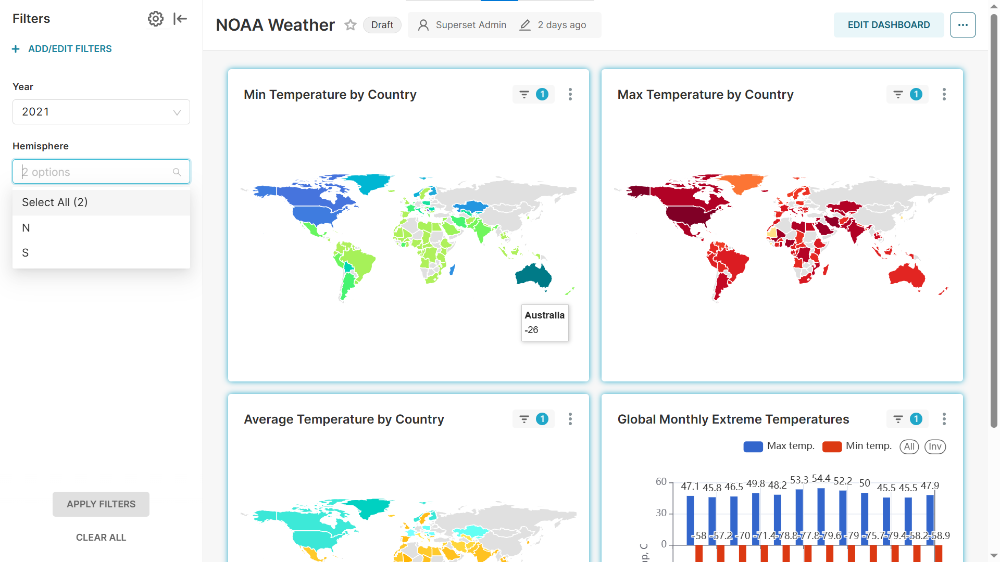

# Построение production-ready хранилища климатических данных NOAA на базе ClickHouse

## Цели проекта

Целью учебного проекта является построение хранилища данных полного цикла, включающего регулярную загрузку обновлений через конвейер ETL, хранение данных в распределённой БД *ClickHouse* и предоставление их пользователям через BI инструмент.

## Источник данных

В данном проекте я буду работать с датасетом *NOAA Global Historical Climatology Network*. Датасет представляет собой измерения метеорологических станций по всему миру. Сам набор данных и работа с ним подробно описаны в статьях [**(1)**](#biblio-01) и [**(2)**](#biblio-02).

Исторические данные разбиты на файлы по годам (последний доступный на сегодняшний день год &mdash; 2022). Одна строка файла представляет собой результат измерения одного показателя одной метеостанцией. Пример данных:

```text
AE000041196,20210101,TMAX,278,,,S,
AE000041196,20210101,PRCP,0,D,,S,
AE000041196,20210101,TAVG,214,H,,S,
AEM00041194,20210101,TMAX,266,,,S,
AEM00041194,20210101,TMIN,178,,,S,
```

Для нашей цели требуется провести следующие трансформации:

1. Фильтрация: необходимо отобрать только интересующие нас записи (подробнее критерии отбора описаны в [**(1)**](#biblio-01)).
2. Транспонирование (денормализация): мы заинтересованы в ограниченном числе показателей, которые будут храниться в соответствующих колонках таблицы.
3. Обогащение: для каждой метеостанции мы хотим знать её географические координаты.

Все эти действия я планирую выполнять на этапе ETL и реализовать в DAG *Airflow*.

## Архитектура решения

Диаграмма общей архитектуры решения представлена ниже.


В основе лежит кластер из 4-х серверов *ClickHouse* в конфигурации 2 шарда и 2 реплики. Такой вариант исполнения предлагает разумный баланс между отказоустойчивостью и производительностью.

### Используемые технологии

* Основная СУБД хранилища: *ClickHouse*
* Оркестрация ETL: *Apache Airflow*
* BI, визуализация: *Apache Superset*
* Мониторинг: *Prometheus*, *Grafana*

### Версии компонентов

| Компонент | Версия |
|---|---|
| apache/airflow | 3.0.4 |
| apache/superset | 4.1.3 |
| clickhouse | 25.7.4.11 |
| grafana | 12.1 |
| prometheus | 3.5.0 |

### Техническая реализация

Я буду запускать все процессы в контейнерах *Docker* на виртуальной машине *Linux*. Таким образом, каждый компонент будет работать на своём виртуальном хосте в виртуальной сети *Docker compose*.

```shell
$ docker ps

CONTAINER ID  IMAGE                                             COMMAND               CREATED       STATUS                   PORTS                                                       NAMES
aa92804ed5ee  docker.io/library/postgres:13                     postgres              32 hours ago  Up 32 hours (healthy)    5432/tcp                                                    noaa_postgres_1
f88e2bd1d827  docker.io/library/redis:7.2-bookworm              redis-server          32 hours ago  Up 32 hours (healthy)    6379/tcp                                                    noaa_redis_1
77aeced51737  docker.io/clickhouse/clickhouse-keeper:25.7.4.11                        32 hours ago  Up 32 hours              0.0.0.0:9181->9181/tcp, 2181/tcp, 10181/tcp, 44444/tcp      clickhouse-keeper-01
dc1e84e6a6ca  docker.io/clickhouse/clickhouse-keeper:25.7.4.11                        32 hours ago  Up 32 hours              0.0.0.0:9182->9181/tcp, 2181/tcp, 10181/tcp, 44444/tcp      clickhouse-keeper-02
0f51cf0fa380  docker.io/clickhouse/clickhouse-keeper:25.7.4.11                        32 hours ago  Up 32 hours              0.0.0.0:9183->9181/tcp, 2181/tcp, 10181/tcp, 44444/tcp      clickhouse-keeper-03
fd9f66259923  docker.io/prom/prometheus:v3.5.0                  --config.file=/et...  32 hours ago  Up 32 hours              0.0.0.0:19090->9090/tcp                                     prometheus
72d64ed6f760  docker.io/prom/node-exporter:v1.9.1               --path.procfs=/ho...  32 hours ago  Up 32 hours              0.0.0.0:19100->9100/tcp                                     node-exporter
18272abb0093  docker.io/apache/superset:4.1.3                   /usr/bin/run-serv...  32 hours ago  Up 31 hours              0.0.0.0:8088->8088/tcp                                      superset
dd3c959722fe  docker.io/grafana/grafana:12.1                                          32 hours ago  Up 32 hours              0.0.0.0:13000->3000/tcp                                     grafana
69ff2618db82  docker.io/apache/airflow:3.0.4                    api-server            32 hours ago  Up 32 hours (healthy)    0.0.0.0:8080->8080/tcp                                      noaa_airflow-apiserver_1
b81ad0eb3442  docker.io/apache/airflow:3.0.4                    scheduler             32 hours ago  Up 32 hours (healthy)    8080/tcp                                                    noaa_airflow-scheduler_1
87193f60b2f3  docker.io/apache/airflow:3.0.4                    triggerer             32 hours ago  Up 32 hours (unhealthy)  8080/tcp                                                    noaa_airflow-triggerer_1
6856861588d5  docker.io/clickhouse/clickhouse-server:25.7.4.11                        32 hours ago  Up 32 hours              0.0.0.0:18123->8123/tcp, 0.0.0.0:19000->9000/tcp, 9009/tcp  clickhouse-01
043c6679af0f  docker.io/clickhouse/clickhouse-server:25.7.4.11                        32 hours ago  Up 32 hours              0.0.0.0:28123->8123/tcp, 0.0.0.0:29001->9000/tcp, 9009/tcp  clickhouse-02
c7b467cf9287  docker.io/clickhouse/clickhouse-server:25.7.4.11                        32 hours ago  Up 32 hours              0.0.0.0:38123->8123/tcp, 0.0.0.0:39002->9000/tcp, 9009/tcp  clickhouse-03
925f6b8b6548  docker.io/clickhouse/clickhouse-server:25.7.4.11                        32 hours ago  Up 32 hours              0.0.0.0:48123->8123/tcp, 0.0.0.0:49003->9000/tcp, 9009/tcp  clickhouse-04
e8bf79ae0c03  docker.io/apache/airflow:3.0.4                    celery worker         32 hours ago  Up 32 hours (unhealthy)  8080/tcp                                                    noaa_airflow-worker_1
```

Компоненты сгруппированы в нескольких файлах конфигурации *Docker compose*. Все они доступны в текущем репозитории.

Команда для запуска всей системы:

```shell
docker compose -p noaa \
    -f airflow.yaml \
    -f clickhouse_2S_2R.yaml \
    -f monitoring.yaml \
    -f superset.yaml \
    up -d
```

## ETL конвейер *Airflow*

*TODO*

## Кластер *ClickHouse*

Топология кластера повторяет один из вариантов, который был исследован в домашнем задании [*[10] Шардирование*](https://github.com/rklepov/OTUS-ClickHouse-2025-03/wiki/%5B10%5D-%D0%A8%D0%B0%D1%80%D0%B4%D0%B8%D1%80%D0%BE%D0%B2%D0%B0%D0%BD%D0%B8%D0%B5#%D1%82%D0%BE%D0%BF%D0%BE%D0%BB%D0%BE%D0%B3%D0%B8%D1%8F-2-%D1%88%D0%B0%D1%80%D0%B4%D0%B0-2-%D1%80%D0%B5%D0%BF%D0%BB%D0%B8%D0%BA%D0%B8-2s_2r): 2 шарда, 2 реплики.

Конфигурации 4-х серверов *ClickHouse* доступны в текущем репозитории. В целом содержимое файлов `config.xml` идентично, за исключением макросов с номерами шарда и реплики. Пример:

```xml
    <macros>
        <shard>01</shard>
        <replica>02</replica>
    </macros>
```

Также для кворума запускаются 3 экземпляра *ClickHouse Keeper*, которые хранят метаданные репликации.

Создадим БД на всех нодах кластера:

```sql
CREATE DATABASE IF NOT EXISTS noaa ON CLUSTER cluster_2S_2R

   ┌─host──────────┬─port─┬─status─┬─error─┬─num_hosts_remaining─┬─num_hosts_active─┐
1. │ clickhouse-04 │ 9000 │      0 │       │                   3 │                3 │
2. │ clickhouse-01 │ 9000 │      0 │       │                   2 │                2 │
3. │ clickhouse-03 │ 9000 │      0 │       │                   1 │                0 │
4. │ clickhouse-02 │ 9000 │      0 │       │                   0 │                0 │
   └───────────────┴──────┴────────┴───────┴─────────────────────┴──────────────────┘

4 rows in set. Elapsed: 0.858 sec.
```

Далее создаём реплицируемую таблицу, в которой будут храниться данные. Таблица естественным образом партицирована по годам и отсортирована в первую очередь по идентификатору метеостанции.

```sql
CREATE TABLE noaa.weather_replicated on cluster cluster_2S_2R
(
   `station_id` LowCardinality(String),
   `date` Date32,
   `tempAvg` Int32 COMMENT 'Average temperature (tenths of a degrees C)',
   `tempMax` Int32 COMMENT 'Maximum temperature (tenths of degrees C)',
   `tempMin` Int32 COMMENT 'Minimum temperature (tenths of degrees C)',
   `precipitation` UInt32 COMMENT 'Precipitation (tenths of mm)',
   `snowfall` UInt32 COMMENT 'Snowfall (mm)',
   `snowDepth` UInt32 COMMENT 'Snow depth (mm)',
   `percentDailySun` UInt8 COMMENT 'Daily percent of possible sunshine (percent)',
   `averageWindSpeed` UInt32 COMMENT 'Average daily wind speed (tenths of meters per second)',
   `maxWindSpeed` UInt32 COMMENT 'Peak gust wind speed (tenths of meters per second)',
   `weatherType` Enum8('Normal' = 0, 'Fog' = 1, 'Heavy Fog' = 2, 'Thunder' = 3, 'Small Hail' = 4, 'Hail' = 5, 'Glaze' = 6, 'Dust/Ash' = 7, 'Smoke/Haze' = 8, 'Blowing/Drifting Snow' = 9, 'Tornado' = 10, 'High Winds' = 11, 'Blowing Spray' = 12, 'Mist' = 13, 'Drizzle' = 14, 'Freezing Drizzle' = 15, 'Rain' = 16, 'Freezing Rain' = 17, 'Snow' = 18, 'Unknown Precipitation' = 19, 'Ground Fog' = 21, 'Freezing Fog' = 22),
   `location` Point,
   `elevation` Float32,
   `name` LowCardinality(String)
) ENGINE = ReplicatedMergeTree('/clickhouse/cluster_2S_2R/{shard}/{database}/weather', '{replica}')
PARTITION BY toYear(date)
ORDER BY (station_id, date);
```

Наконец, создаём распределённую таблицу.

```sql
CREATE TABLE noaa.weather ON CLUSTER cluster_2S_2R AS noaa.weather_replicated
ENGINE = Distributed('cluster_2S_2R', 'noaa', 'weather_replicated', cityHash64(station_id))
```

Как добавление данных через *Airflow*, так и запрос данных для визуализации в *Superset*, будут происходить именно через распределённую таблицу.

## Визуализация в *Superset*

Настройка *Superset* повторяет домашнее задание [*[18] Визуализация данных*](https://github.com/rklepov/OTUS-ClickHouse-2025-03/wiki/%5B18%5D-%D0%92%D0%B8%D0%B7%D1%83%D0%B0%D0%BB%D0%B8%D0%B7%D0%B0%D1%86%D0%B8%D1%8F-%D0%B4%D0%B0%D0%BD%D0%BD%D1%8B%D1%85), поэтому здесь подробности приводить не буду.

Фрагмент дашборда *Superset* ниже.



На дашборде можно посмотреть, например, максимальную, минимальную и среднюю температуру воздуха в течение года в каждой стране (по которой есть данные с метеостанций на её территории). Код страны включён в идентификатор метеостанции, что позволяет извлечь его и использовать для соответствующей визуализации (карта мира).

## Мониторинг

Здесь я реализовал стандартный мониторинг скрверов кластера *ClickHouse*, в целом повторяющий реализацию из домашнего задания [*[14] Мониторинг*](https://github.com/rklepov/OTUS-ClickHouse-2025-03/wiki/%5B14%5D-%D0%9C%D0%BE%D0%BD%D0%B8%D1%82%D0%BE%D1%80%D0%B8%D0%BD%D0%B3). Метрики собираются с помощью *Prometheus* и затем визуализируются на стандартных дашбордах *Grafana*. Поэтому здесь не буду приводить подробностей.

*TODO*: мониторинг конвейера ETL, алертинг.

## Библиография

<a name="biblio-01"></a>
**\[1]** [*NOAA Global Historical Climatology Network | ClickHouse Docs*](https://clickhouse.com/docs/getting-started/example-datasets/noaa)

<a name="biblio-02"></a>
**\[2]** [*Exploring massive, real-world data sets: 100+ Years of Weather Records in ClickHouse*](https://clickhouse.com/blog/real-world-data-noaa-climate-data)

<a name="biblio-03"></a>
**\[3]** [*Data Pipelines with Apache Airflow - Bas P. Harenslak and Julian Rutger de Ruiter*](https://www.manning.com/books/data-pipelines-with-apache-airflow)
